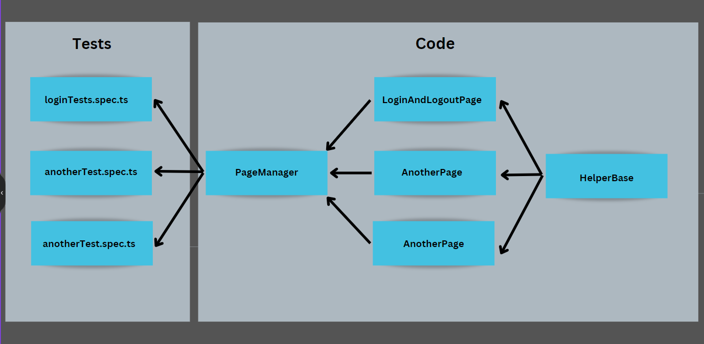

# Playwright Test Automation Assignment for Kindred
This project contains automated test scripts created with Playwright test automation framework and TypeScript.

## How to run tests locally
- Clone the repository `kindred_test` to your local machine.
- There are two ways to run playwright tests
  - Use VS Code extension to run tests.
  - Use command line to run tests.

### VS Code extension

- Dowldoad and activate `Playwright Test for VSCode` extension.
- add `.env` file at the root level of `kindred_test` directory.
- add the below lines with values,

```
BASE_URL=
USERNAMEVALUE=
PASSWORD=
FIRSTNAME=
LASTNAME=
POSTALCODE=

```
- Open Playwright extension and run tests (If you click on 'Run all tests' button, it will run all tests).

### Use command line

- Open local terminal window
- CD into `kindred_test` directory on local machine.
- Use the npm script from `package.json` or standard playwright commands as mentioned below,

1. npm run regression
2. npx playwright test (This command witth run all tests headless)
3. npx playwright test --headed (This command run all tests with open browser window)

```` Ex: npm run regression ````


````Note: all .env files are ignored in .gitignore file at the root level of the parent project. ````

## Folders

#### .github/workflows :
- Pipelines for CI/CD with github actions.

#### page-objects :
- This folder contains the code for all pages (page-object-model).
- pageManager that manages all page objects.
- helperBase that contains methods to be used in page objects.

#### tests :
- This is where all the tests live.

### Test Automation Architectue : 

